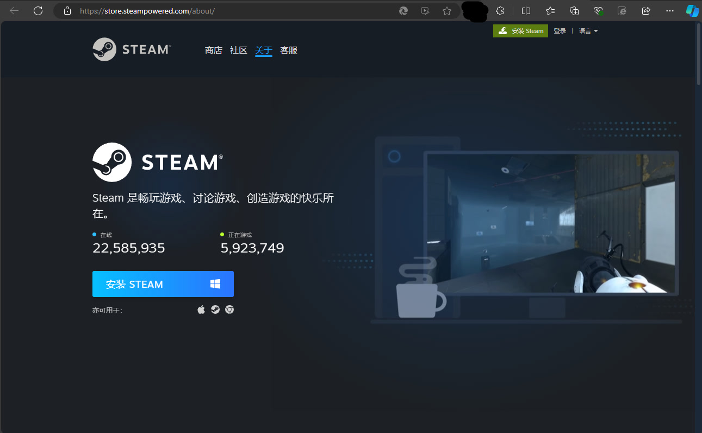
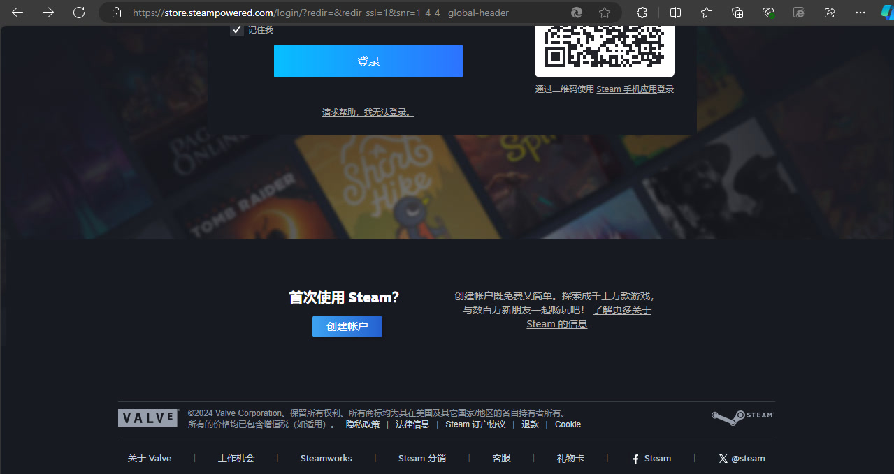
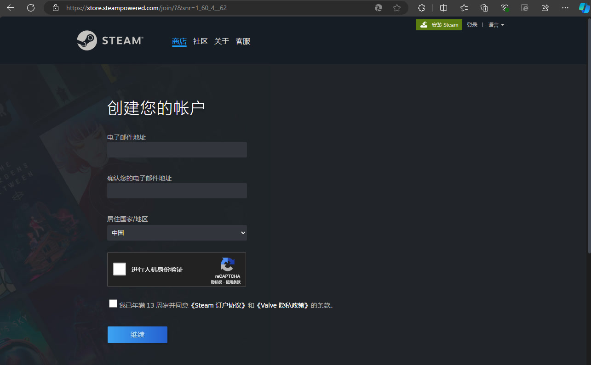

# 如何下载steam

## 概述

本文将教你如何安装正版steam并注册一个steam账号

## 安装Steam

### 前言

由于steam是国外平台，所以其网站可能加载较慢或者无法访问，如果出现了无法加载网页的情况，请找一个游戏加速器并加速steam

同样，steam安装完成后，如果不使用加速器，则无法打开社区，聊天窗口有时候无法上传图片，商店界面有时候打不开

推荐用UU加速器（不是广告，因为在登陆后加速steam是免费的）

[UU加速器官网](https://uu.163.com/index.html)

>tip：加速器是作用于网络的！！！不是加速电脑的！！！它只起到降低网络延迟的作用！！！

### 下载steam安装程序

为了防止各大搜索引擎的广告的误导

steam的官方网站是 [这里](https://store.steampowered.com/) （默认打开是商店，要点一下右上角的“安装steam”）

下载页直达 [这里](https://store.steampowered.com/about/)

下载界面应该是这样的

对于其它平台，这个网站会自动检测你的操作系统，所以一般情况下直接“点击安装steam”即可

点击安装steam以后，该网站会自动下载一个安装程序，对于Edge浏览器来说，点击“打开文件”即可，不同的浏览器操作方法大同小异。不过有的浏览器（比如Edge）会对下载的应用程序进行检查，这个时候点击“打开文件”可能没有反应，稍微等一会就可以了，如果实在打不开，用文件管理器打开你的下载目录（或者是点击浏览器的“打开下载目录”），右键刚刚下载的程序，以管理员权限运行即可。

然后你就可以像安装其他程序一样安装steam了，不过steam在首次启动的时候会自动更新，更新的速度取决于你的网速，耐心等待其更新完成即可，更新完成以后，就可以使用steam了。在更新的时候我们可以先去注册steam账号（如果你没有steam账号）

## 注册steam账号

点击 [steam官网](https://store.steampowered.com/) 右上角的登录，然后在弹出的页面里面往下滑，点击下面的“创建账户”

这个时候就会来到注册界面，根据页面要求填写你的信息，操作即可

>tip：如果你没有邮箱，那么你可以用QQ邮箱，地址是 <你的QQ号>@qq.com （不包括那两个小于大于符号！），形如 1234567890@qq.com

然后你的邮箱就会收到steam的一封邮件，里面包含了继续注册你的账户的网址，所以**邮件别瞎填！！！**

然后会要求填写用户名和密码,用户名是唯一的，**非常重要**，登陆和找回密码的时候要用到。你在steam里面显示的名字是昵称，可以重名，默认是一串数字，可以自己改

## steam手机版

>什么？steam有手机版？我能在手机上玩steam上的游戏吗？

有是有，但玩游戏当然是不行的！想玩游戏可以考虑用steam link，这里不赘述，感兴趣可以自己去了解->[传送门](https://cn.bing.com/search?q=steam+link)

steam的移动端最大的用处是充当二步验证器（就是让你填写5个字母/数字），和扫码登陆（二者前提是你在steam移动端登录了你的账号）

## 装不起

先根据前面一步步排查是自己那里没弄好，然后去搜索对应的情况，自己找找解决方法，实在找不到可以在 [这里](http://justask.dynv6.net/) 提问