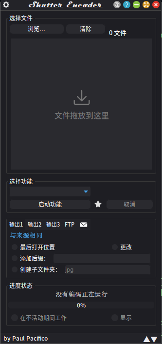

# 自定义安卓开机动画的方法

## 概述

本文将教会你如何自定义安卓启动动画

## 注意

1. 通常情况下替换开机动画不会导致系统崩溃等严重后果，通常只是不播放开机动画直接进入系统。但是在一些极端情况下还是有可能导致系统崩溃。
所以建议您提前做好备份，防止无法开机等极端情况的发生（这样损失可以最小化）

2. 虽然大多数设备可以通过本文的方法实现开机动画的替换，但是这种方法对于某些设备可能行不通，对于这些设备可能需要您自行寻找解决方法。
**本文的方法不保证所有设备通用**

## 制作开机动画

所需材料/文件/能力：

1. 能熟练操作电脑（包括不限于压缩/解压缩，软件的安装）
2. 能修改/system目录的安卓手机
3. 能上网的电脑（用来制作动画文件）
4. 动画的视频/图像序列

>图像序列是什么？
>
>这里的图像序列是指文件名具有序列化特征的一系列相同格式图片
>
>（序列化特征：文件名长度相同，其中的某个数字依次递增，形如：0001.jpg、0002.jpg、0003.jpg .....）

已经使用了Magisk来root手机的可以跳到“替换动画文件”

### 准备工作

#### 图像序列的制作

如果你已经准备好了了图像序列，你可以跳到小结“动画文件的制作”

从视频制作图像序列会用到：ShutterEncoder（基于ffmpeg）

[软件下载](https://www.shutterencoder.com/#downloads)

>Tip1：软件有两个版本（功能没有差异），一个是portable（便携版，下载下来就是一个可以运行的主程序），一个是install（下载下来还要安装），可以看自己的需求来选择，如果估计以后没有转码那一些的需求就可以下载portable版本，用完了以后就可以删掉
>
>Tip2：如果点了下载它另外开了捐赠窗口关掉即可，如果下载一直未开始，并且显示了“where is my download”，可以点击该字条展开，然后点击你的平台（点一次就够了）
>
>Tip3：虽然官网下载速度是慢了点（笔者这里大概350KB/s），但是我不推荐用第三方下载平台，谁知道他们会往里面添加什么东西

>为什么不是格式工厂？
>
>因为其安装程序有一定的流氓性，一不留神就被安上了其他软件

安装完成以后打开软件，应该是这样的

>关于视频的一些要求：尽量让文件名只包含英文，包含其它字符可能会有问题

将你的视频拖进去，点击选择功能下面的小三角形，选择“图像创建”里面的“JPEG”（没找到的话多找找，肯定有）

在选择了JPEG以后，功能的右边会出现一个一个百分比，这个是jpeg的质量选择。众所周知，system分区（也就是/system目录）的大小是比较小的，所以说如果没有特殊需求尽量选95%及以下，这样可以节约一些空间，转换完可以看看输出文件夹的大小，推荐动画包不大于30MB，如果条件允许就当我没说

这个时候软件就会自动展开了，勾选右上角的“从视频创建图像序列”，这个时候下面的“解读视频镜头到__fps”会自动填入一个数值，这个值是原视频的帧率（windows下查看视频帧率可以：右键文件->属性->详细信息，里面的“帧速率”就是帧率了），一般情况下不用自己更改（当然为了减小设备播放动画的压力可以改小到原来的1/2甚至1/4，但是代价是动画会更“卡顿”）

>tip1：帧率是指每秒画面切换的速率，这里的帧率是决定从你的视频里面截取图片的间隔，帧率越小间隔越大，反之
>
>tip2：如果你遇到了有小数的帧率数，那么这个视频的帧率就按照这个小数四舍五入取整来看

完成之后选择一个输出位置，就是在软件左侧的输出那里，不用管那些123的，点击更改就可以自动弹出一个窗口让你选路径了，建议单独放一个文件夹

一切就绪之后就可以点击启动功能了，然后图片就会输出到指定文件夹里面了

#### 动画文件的制作

软件：7zip（**理论上**其它压缩软件应该也可以）

[软件下载](https://www.7-zip.org/download.html)

>tip1：一般情况下选择windows 64bit（第一行的）就可以了
>
>tip2：安装完成以后你可能会发现打开方式还是没变，这是因为7zip要手动关联，从开始菜单打开7zip file manger，工具->选项，弹出来的第一个页面就是关联文件格式了，在你的用户名那一栏下面的某一格式那一排单击就是切换关联状态，推荐关联：zip、7z、rar、001，其它可以不管
>
>tip3：其实如果你不想关联也可以直接在右键菜单里面找到7zip，如果没有的话要么是被你电脑的杀毒软件制裁了，要么你的电脑是win11，它被隐藏到展开的菜单里面了

这个动画文件的文件名叫做bootanimation.zip，存在于/system/media下，这就是为什么要求那台安卓手机要能更改system分区

制作这个文件要将动画目录和desc.txt（动画参数文件）放在一起打包进一个“仅压缩”的bootanimation.zip的根目录

>tip：最好的方式是将你的手机的动画文件（位置是/system/midia/bootanimation.zip）复制出来进行更改，因为笔者之前就是自己打包但是不知道为什么就是播不了但是用替换法就可以了。同时原本动画的文件大小还可以作为一个参考，尽量不用超过这个大小就对了

打开bootanimation.zip，里面有两大部分

1. 动画部分（就是那些文件夹）
2. 动画参数文件（desc.txt）

动画部分没啥好说的，就是把原本的文件夹删除了，把你自己的文件夹放进去

重点讲一下desc.txt

首先，第一行有三个参数，以空格间隔开，分别描述动画的长，宽，帧率

这里的长宽和帧率其实不用和生成的jpg的一模一样，这是播放参数，比如说你
1280x720的图片填了1920x1080的话，系统就自动把图片强制拉伸为1920x1080

至于动画的帧率，这里的帧率是指播放帧速率，也就是动画播放的快慢，数字越大，每秒钟切换的图片数量就越多（切换你制作好的图片），播放得就越快，但有些设备可能撑不住，会出现卡顿，一般情况下30就行了

如果想更改必须按照你的设备的刷新率的的整数倍缩小（不知道就自己搜，一般是60），否则会出现“judder”（具体见[影视剧风的视频](https://www.bilibili.com/video/BV1hp4y1f7B5/)）（其实也不是必须，只是为了更好的观看体验）

然后下面的东西就是用于描述每阶段动画的了，其中可以包含多段动画，也就是多行描述动画的文本

结构：动画种类 单组动画播放次数 播放下一组动画的间隔帧数 动画文件夹 （每一项用一个空格隔开）

- 动画种类：动画种类有两种，“c”和“p”，“c”是无论系统是否启动完成都不中断该组动画，“p”是系统启动完成以后立即结束这一组动画

- 单组播放次数：单组播放次数很好理解，就是循环播放次数，对于“p”类型的动画，填写0是无限循环的意思，而0对于“c”类型的动画无效

- 间隔帧数：当前组动画播放完成以后间隔多少帧播放下一组。值得注意的是：这里是间隔帧数，而不是时间（毫秒那些），也就是说它的单位是帧，时间长度与动画的单帧播放长度相同（1/你在上面设定的帧率）

- 动画文件夹：就是你复制进去的文件夹名字（推荐用英文），注意，只是文件夹名字，里面的图片名字不用管（都建议只包含英文）

>特别注意：desc.txt不能留一行，也就是在最后多一排空白的，这种情况把光标转到最后的空白行按退格就可以了，否则就无法播放！

编辑完成以后记得将更改保存到zip里面（7zip可以直接点开，保存关闭编辑器以后会提示是否保存更改）

## 替换动画文件

### 对于使用传统方法root的设备

用已经root的安卓手机为例，用mt管理器转到/system/meida目录，然后找到bootanimation.zip，你可以删掉或者给它改个名字，然后把新做的zip放进去，这个时候重启手机就可以看到新的动画了

###对于使用magisk来root的设备

magisk的用户可以使用模块法，可以使用爱玩机工具箱->导航->magisk专区->magisk模块制作->开机动画模块制作。在弹出的选择器里面选择做好的zip就可以了

而且它也支持直接从MP4制作，可以省去前面一大堆步骤

### 对于ADB可以修改/system目录的设备

至于ADB是什么，怎么装可以看[这篇博客](https://blog.csdn.net/Python_0011/article/details/132040387)（网上找的），挺详细的

有的手机通过adb似乎可以更改system的文件，则可以通过这些adb命令

    adb pull /system/media/bootanimation.zip #把原本的bootanimation.zip拉出来
    adb push <zip文件路径> /system/media

如果push失败的话ADB这条路大概率是行不通了

## 一些特殊设备

希沃可以参考 [这篇教程](https://www.bilibili.com/read/cv25032067/)